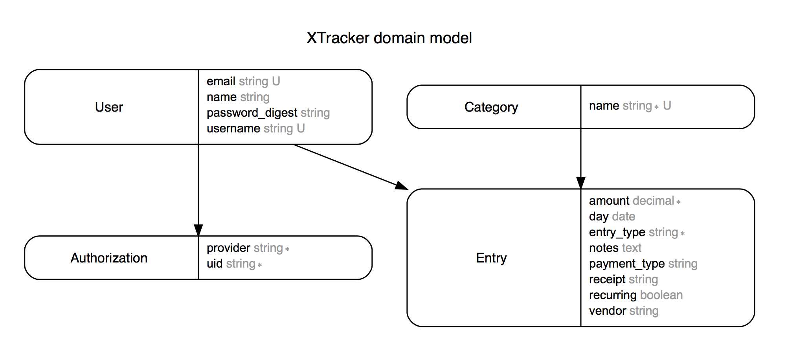

# xTracker - [Live Link](https://x-tracker.herokuapp.com/)


xTracker is a easy way to organize your expenses receipts and create reports by date, vendors and category.

Users will be able to create a profile, create new transactions, create and download a pdf file for reports.


Feel free to fork / star / watch for your own personal use.


## Entity-Relationship Diagram


## Technologies Used   

#### Languages:
HTML5, JavaScript, CSS, Ruby
#### External Libraries:
jQuery, Materialize
#### Frameworks:
Rails

## Code We're Proud Of
``` ruby
def create_with_facebook
  auth_hash = request.env['omniauth.auth']
  @authorization = Authorization.find_by_uid(auth_hash.uid)

 if @authorization
   @user = User.find_by_id(@authorization.user_id)
   login(@user)
   flash[:notice] = "Successfully logged in."
   redirect_to dashboard_path
 else
   @authorization = Authorization.create(provider: auth_hash.provider,
                                          uid: auth_hash.uid)
   @user = User.create(name: auth_hash.info.name,
                       email: auth_hash.info.email,
                       password: "facebook",
                       username: auth_hash.info.name)
  @user.authorizations << @authorization


   login(@user)
   flash[:notice] = "Successfully logged in."

   redirect_to dashboard_path
 end
end

```

## Trello Board
[Wireframes, Database models & Sprint Planning](https://trello.com/b/vMhofb1o/xtracker)

### Contributors
[Greice Silva](https://www.linkedin.com/in/greicesilva/)

### screen shots

